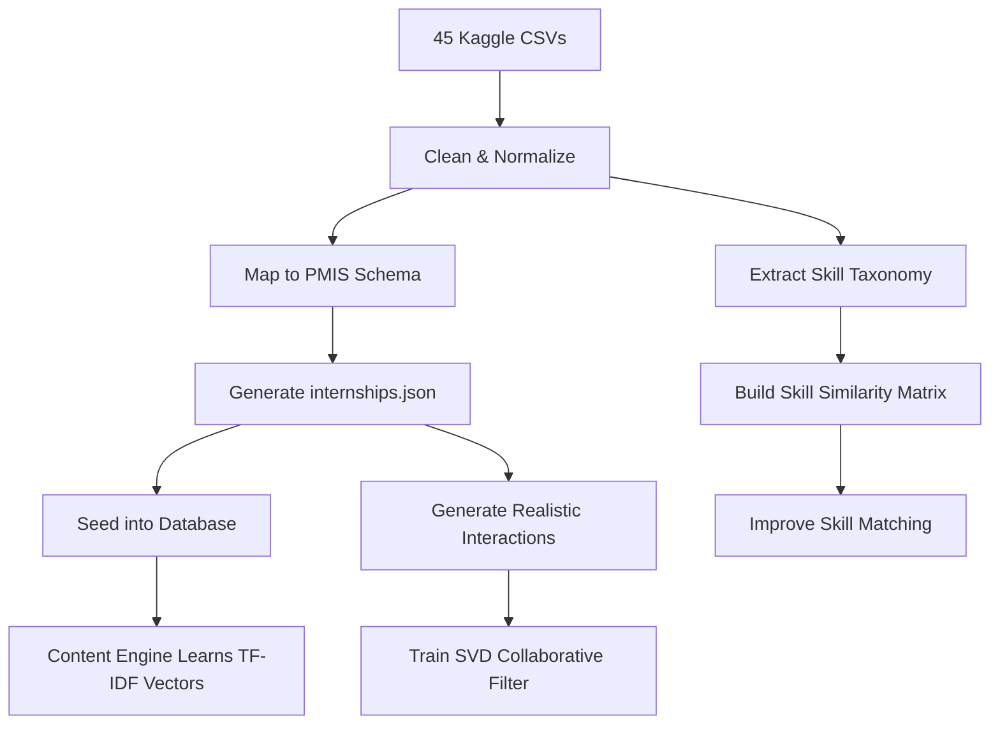

# ML Model Training Plan — PMIS Internship Recommendation Engine

## 🎯 Goal
Train a personalized recommendation engine that matches PM Internship Scheme candidates with the **right** internships based on their wizard profile data, using real Kaggle datasets to replace our current synthetic/hardcoded internship data.

---

## 📊 How Things Work RIGHT NOW (Current Architecture)

### What the Wizard Collects from Each Candidate:
| Step | Data Collected | DB Field | Used by ML? |
|------|---------------|----------|-------------|
| 0 | Aadhaar ZIP + Share Code | `aadhaar_name`, `aadhaar_hash` | ❌ Identity only |
| 1 | Document Upload (10th/12th) | `documents` table | ❌ Verification only |
| 2 | **Education Level** (10th/12th/ITI/Diploma/Graduate/PG) | `education_level` | ✅ 20% weight |
| 3 | **Skills** (Python, SQL, Excel, etc.) | `skills` (JSON array) | ✅ **35% weight** (highest!) |
| 4 | **Sector Preferences** (IT, Banking, Healthcare, etc.) | `sector_preferences` (JSON array) | ✅ 15% weight |
| 5 | **State + Location Preference** (Home/Nearby/PAN India) | `state`, `location_preference` | ✅ 20% weight |
| 6 | **Video Introduction** (analyzed by Groq AI) | `video_overall_score`, `video_skills_detected` | ✅ Up to +15% bonus |

### Current ML Scoring Formula:
```
Final Score = Content Score (60%) + Collaborative Score (40%) + Video Bonus + Affirmative Action Boost

Content Score = Skills (35%) + Education (20%) + Location (20%) + Sector (15%) + Field of Study (10%)
```

### How Internship Data is Currently Loaded:
- A **synthetic generator** (`synthetic_generator.py`) creates **500 fake internships** from hardcoded company names (TCS, Infosys, Wipro, etc.)
- These are loaded via `seed.py` into the database
- The ML engine then scores each candidate against these 500 internships

### Current Limitations:
1. **Fake internships** — The internship data is randomly generated, not real
2. **No real skill-to-company mapping** — TCS internship might randomly require "Pharmacy" skills
3. **Collaborative filtering is untrained** — The SVD model has no real interaction data
4. **Content engine uses simple string matching** — "Python" matches "Python" but "ML" doesn't match "Machine Learning"

---

## 🔄 What Changes With Kaggle Data

### What Kaggle Datasets Can Give Us:
Your 45 Kaggle links likely contain data like:
- **Company names** + their **sectors/industries**
- **Job/internship descriptions** with **required skills**
- **Salary/stipend ranges**
- **Locations** (city, state)
- **Education requirements**
- **Skill taxonomies** (which skills are related to which roles)

### The Training Pipeline (Step by Step):



---

## 🧠 Training Plan — 4 Phases

### Phase 1: Data Ingestion (Kaggle → Clean JSON)
**What we do:** Write a script that reads your 45 Kaggle CSVs and transforms them into our `internships.json` format.

**Mapping:**
| Kaggle Column | → PMIS Field | Example |
|---------------|-------------|---------|
| Company Name | `company_name` | "Tata Consultancy Services" |
| Job Title | `role_title` | "Software Developer Intern" |
| Skills Required | `required_skills` | ["Python", "SQL", "React"] |
| Industry/Sector | `sector` | "IT & Software" |
| Location | `city`, `state` | "Mumbai", "Maharashtra" |
| Min Qualification | `min_education` | "GRADUATE" |
| Salary/Stipend | `stipend_amount` | 5000 |

**Learning:** The model learns what skills TCS *actually* requires vs. what Infosys requires. This makes the skill-matching realistic instead of random.

### Phase 2: Skill Taxonomy Enhancement 
**What we do:** Build a **skill similarity graph** from the Kaggle data. If 80% of internships that need "Python" also need "SQL", those skills become related.

**Current Problem:**
- Candidate has: `["Python", "Data Analysis"]`
- Internship needs: `["Machine Learning", "Pandas", "SQL"]`
- Current engine: 0% match (no exact string overlap!)

**After Training:**
- Engine knows Python → Pandas (0.85 similarity), Python → ML (0.72), Data Analysis → SQL (0.68)
- New score: ~75% match ✅

**How:** We use TF-IDF vectors from all Kaggle job descriptions. Skills that co-occur frequently in the same descriptions have high similarity.

### Phase 3: Collaborative Filter Training (SVD)
**What we do:** Generate **smart synthetic interactions** using real Kaggle data patterns.

Instead of random `VIEW/SAVE/APPLY` events, we simulate:
- IT students VIEW IT internships more → `APPLY` to ones matching their skills
- Rural students with `HOME_STATE` preference → higher `APPLY` rate for local companies
- SC/ST students → interact with companies known for diversity programs

This trained SVD model then predicts: *"A candidate similar to you applied to these internships and was successful."*

### Phase 4: Re-weight the Scoring Formula
**What we do:** Tune the weights based on what actually matters.

Current: `Skills 35% + Education 20% + Location 20% + Sector 15% + Field 10%`

After analysis, it might become: `Skills 40% + Sector 20% + Location 15% + Education 15% + Field 10%`

We can determine this by testing: *"Which weight combination gives the highest precision@5?"* (meaning the top-5 recommendations are most relevant).

---

## 🎓 What You'll Learn

| Phase | Concept | Real-World ML Skill |
|-------|---------|-------------------|
| 1 | Data cleaning, normalization, schema mapping | **ETL Pipeline** (Extract, Transform, Load) |
| 2 | TF-IDF vectorization, cosine similarity | **NLP Feature Engineering** |
| 3 | Matrix factorization, SVD, cold-start handling | **Collaborative Filtering** |
| 4 | Hyperparameter tuning, precision@K, NDCG | **Model Evaluation** |

---

## 🔧 What Wizard Data Can Be Enhanced

> [!IMPORTANT]
> These are optional enhancements we can add to the Wizard to collect MORE signals for better recommendations.

| Enhancement | Wizard Change | ML Benefit |
|------------|--------------|------------|
| **Academic Score** | Add a "% / CGPA" input field | Better education scoring (85% student vs 50% student) |
| **Work Experience** | "Any prior internship/work?" toggle | Distinguish beginners from experienced |
| **Language Skills** | Multi-select for spoken languages | Match with companies needing regional language skills |
| **Availability** | "When can you start?" date picker | Filter time-sensitive internships |
| **Resume Upload** | Already exists (Step 1) | Extract additional skills via `ResumeParser` ML |

---

## 📝 Open Questions (Need Your Input)

> [!IMPORTANT]
> Please share the 45 Kaggle links so I can analyze what columns/data they contain. The exact training approach depends heavily on what fields are available.

1. **Share the Kaggle links** — Are they CSV files? JSON? How large are they?
2. **Quality check** — Do the datasets have Indian companies specifically, or are they global job listings?
3. **Priority** — Should we focus on making the internship data realistic first (Phase 1-2), or also train the collaborative filter (Phase 3)?
4. **Wizard enhancements** — Do you want to add any new fields to the wizard, or keep it as-is?

---

## ✅ Summary

| What | Current State | After Training |
|------|--------------|----------------|
| Internship Data | 500 randomly generated | Real companies from Kaggle |
| Skill Matching | Exact string match only | Semantic + co-occurrence similarity |
| Collaborative Filter | Untrained (returns 0) | Trained SVD on realistic interactions |
| Match Accuracy | ~Random (hardcoded) | Personalized to candidate profile |
| "Why This Match" | Generic explanation | Specific: "Your Python skills match 85% of TCS requirements" |
